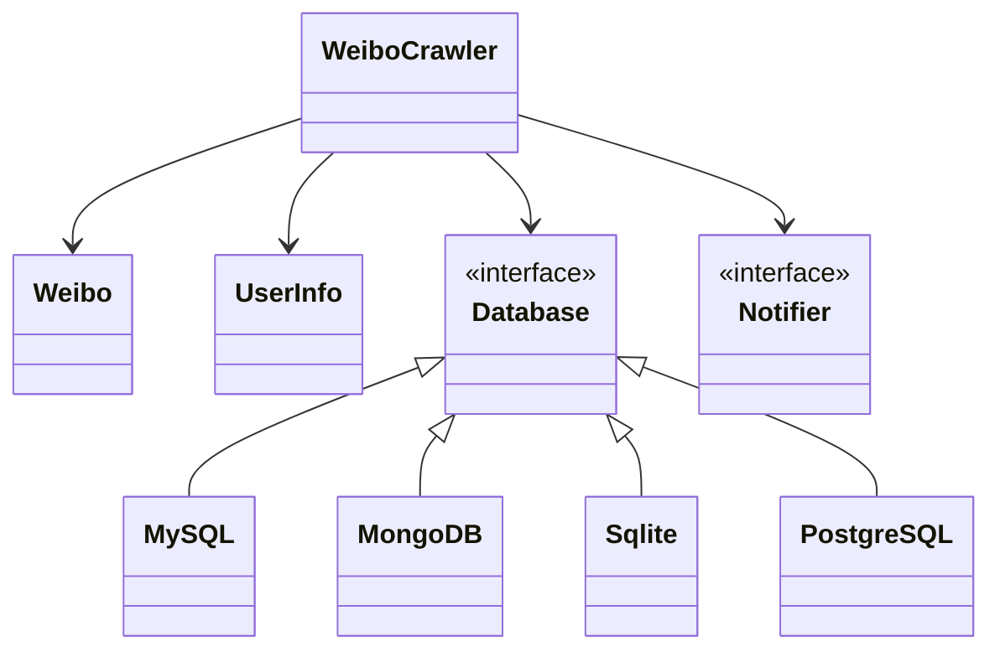

```mermaid
classDiagram
class WeiboCrawler
class Weibo
class UserInfo
class Database {<<interface>>}
class Notifier {<<interface>>}
class MySQL
Class MongoDB
class Sqlite
class PostgreSQL

WeiboCrawler --> Weibo
WeiboCrawler --> UserInfo
WeiboCrawler --> Database
WeiboCrawler --> Notifier
Database <|-- MySQL
Database <|-- MongoDB
Database <|-- Sqlite
Database <|-- PostgreSQL
```
